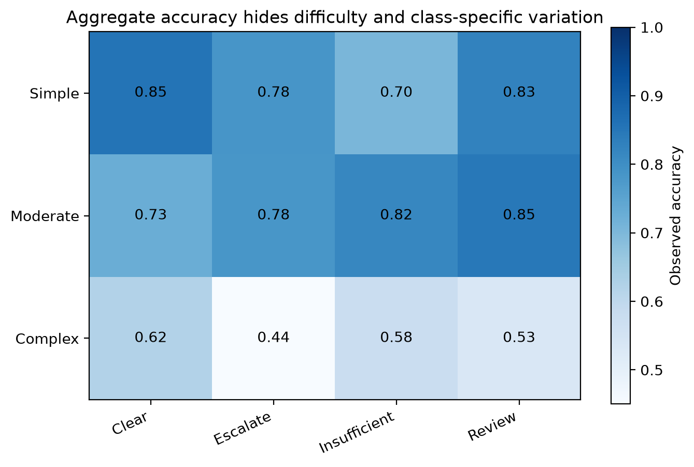

# Chapter 8 · Accuracy and Its Discontents

Accuracy is often the first number people ask for, but it can hide unequal errors, unequal difficulty, and shifting composition. In Project Frog, different mixes of `Simple`, `Moderate`, and `Complex` cases can change the aggregate result even when within-stratum behavior is stable.



## Working assumptions

- The cost of an error depends on which class is confused and in what context.
- Aggregate accuracy can change when the case mix changes.
- Difficulty strata are observed imperfectly and are still simplifications.
- A useful report must show more than one number.

## Worked Python example

```python
from trustworthy_ai_evaluation.synthetic import generate_project_frog_data

project_frog = generate_project_frog_data(seed=20260914)
classification = project_frog[project_frog["component_name"] == "Classification"]

accuracy_by_difficulty = (
    classification.groupby("difficulty")["prediction_correct"].mean().sort_index()
)
accuracy_by_reference_class = (
    classification.groupby("reference_class")["prediction_correct"].mean().sort_index()
)

print(accuracy_by_difficulty)
print(accuracy_by_reference_class)
```

This kind of stratified report exposes structure that a single aggregate cannot.

## Why accuracy can mislead

Accuracy treats all errors equally. That can be acceptable for some descriptive checks, but poor for decisions involving asymmetric costs, human review load, or abstention policy.

## Common incorrect interpretation

> “If overall accuracy improved, the system definitely got better.”

## Corrected interpretation

An accuracy change can come from composition shifts, threshold changes, label changes, or real model changes. Interpret it only after checking [comparability](../glossary.md#comparability), class distribution, and the decision costs.

## Decision-oriented conclusions

- Always pair aggregate accuracy with stratified reporting.
- Document whether case mix changed between evaluations.
- Add decision-relevant metrics when error costs are asymmetric.
- Treat accuracy as a starting summary, not a complete argument.

## Practical exercises

1. Explain how a harder later test set could reduce aggregate accuracy without any true regression.
2. List one decision for which overall accuracy would be an especially weak headline metric.
3. Write a short report sentence distinguishing measurement from interpretation.

## Summary

<div class="chapter-summary">
Accuracy is useful, but incomplete. Once you ask what a score means, you are ready for [What Does Confidence Mean?](what-does-confidence-mean.md).
</div>
