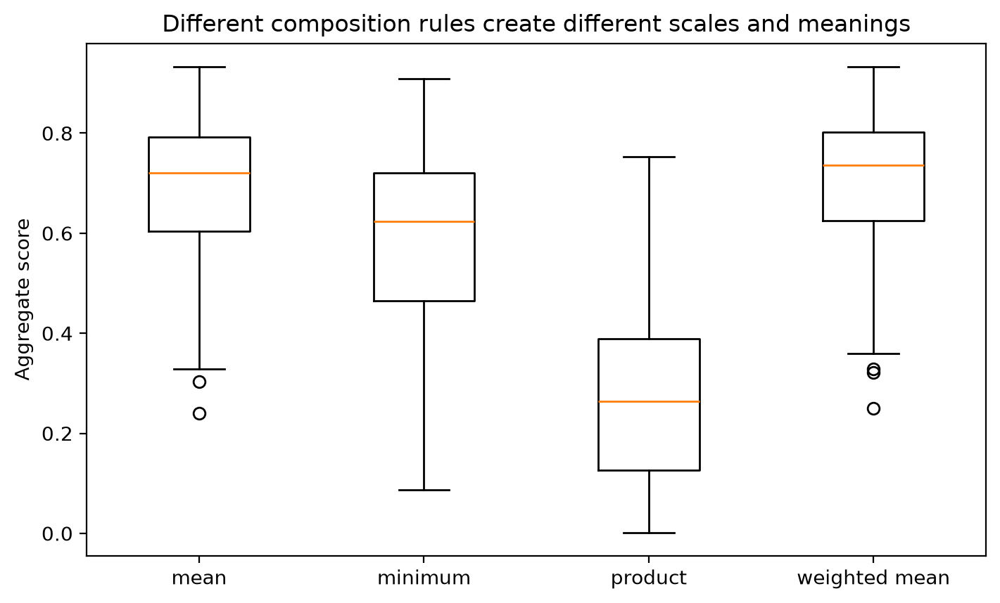

# Chapter 14 · Combining Confidence Scores

There is no universal formula for combining component scores. A numerically tidy aggregate can still be meaningless, badly calibrated, or operationally misleading.



## Anti-pattern

> **Overall confidence equals the average of all available component scores.**

That average is not automatically meaningful because the inputs may refer to different events, use different calibration populations, and fail together.

## Working assumptions

- Component scores are semantically different unless proven otherwise.
- Dependence matters: components can fail together.
- Any proposed aggregate needs end-to-end validation.
- Abstention and human review are valid outcomes, not failures of evaluation design.

## Worked Python example

```python
import pandas as pd

from trustworthy_ai_evaluation.synthetic import generate_project_frog_data

project_frog = generate_project_frog_data(seed=20260914)
wide = project_frog.pivot_table(
    index="case_id",
    columns="component_name",
    values="calibrated_probability",
)

combined = pd.DataFrame(
    {
        "minimum": wide.min(axis=1),
        "mean": wide.mean(axis=1),
        "weighted_mean": (
            0.20 * wide["Document extraction"]
            + 0.40 * wide["Classification"]
            + 0.25 * wide["Evidence retrieval"]
            + 0.15 * wide["Explanation generation"]
        ),
        "product": wide.prod(axis=1),
    }
)

print(combined.describe().round(3))
```

## Candidate approaches and their limits

| Approach | Output meaning | Required assumptions | Suitable uses | Unsuitable uses |
| --- | --- | --- | --- | --- |
| Minimum | Conservative lower bound on the chosen scale | Common semantics or justified worst-case rule | Safety gating | Interpreting as probability without proof |
| Maximum | Best-case signal on the chosen scale | Useful only for specific optimistic routing rules | Triggering extra evidence retrieval | Release confidence claims |
| Arithmetic mean | Central tendency of the supplied numbers | Semantic compatibility and validated weights | Descriptive dashboards | End-to-end trust claims |
| Weighted arithmetic mean | Policy-weighted average | Weight justification and validation | Workflow triage | Claiming calibrated probability by default |
| Geometric mean / product | Joint-like score | Independence or defensible conditional factorization | Narrow Bayesian-style setups | Generic pipeline aggregation |
| Rule-based policy | Action category, not probability | Decision rules tied to harms | Escalation and abstention | Probability reporting |
| Calibrated meta-model | Learned end-to-end risk estimate | Sufficient training data and monitoring | Release support tools | Use outside validation regime |
| Keep score vector | No forced aggregation | Separate semantics retained | Human review and diagnostics | Single-number dashboards |

## Common incorrect interpretation

> “If the average combined score is high, the pipeline must be trustworthy.”

## Corrected interpretation

A combined score is trustworthy only if its meaning is defined and validated against a real end-to-end outcome. Otherwise it is just arithmetic.

## Decision-oriented conclusions

- Prefer keeping a vector of scores when semantics differ.
- Use rule-based abstention or escalation when component failures are consequential.
- Validate any aggregate against end-to-end correctness, calibration, subgroup behavior, and coverage-risk trade-offs.
- Do not recommend a universal formula.

## Practical exercises

1. Explain why multiplying retrieval relevance by class probability is not automatically justified.
2. Describe one setting where a rule-based policy is better than a numeric aggregate.
3. List the extra evidence required before calling an aggregate a calibrated probability.

## Summary

<div class="chapter-summary">
Component confidence does not add up mechanically. The next step is to return to the actual operational question: what evidence is enough for release in [Release Readiness Under Uncertainty](release-readiness-under-uncertainty.md).
</div>
