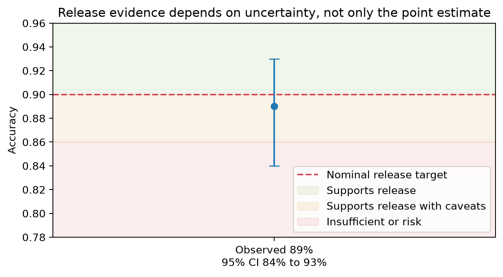

# Chapter 21 · Release Readiness Under Uncertainty

Suppose Project Frog shows **89%** observed accuracy with a **95% confidence interval from 84% to 93%**, while the nominal release target is **90%**. The point estimate looks close to target, but the interval still crosses both acceptable and unacceptable regions.



## Evidence classifications

Use these four labels consistently:

- **Evidence supports release**
- **Evidence supports release with caveats**
- **Evidence is insufficient**
- **Evidence indicates release risk**

## Working assumptions

- The release target is a policy threshold, not a law of nature.
- Consequence severity and [risk appetite](../glossary.md#risk-appetite) matter as much as the point estimate.
- A confidence interval summarizes uncertainty but does not encode all decision costs.
- Additional data collection is a valid outcome.

## Worked Python example

```python
observed_accuracy = 0.89
confidence_interval = (0.84, 0.93)
release_target = 0.90

if confidence_interval[0] >= release_target:
    evidence_classification = "Evidence supports release"
elif observed_accuracy >= release_target and confidence_interval[0] >= 0.86:
    evidence_classification = "Evidence supports release with caveats"
elif confidence_interval[1] < release_target:
    evidence_classification = "Evidence indicates release risk"
else:
    evidence_classification = "Evidence is insufficient"

print(evidence_classification)
```

This decision rule is only illustrative, but it demonstrates why a point estimate alone is insufficient.

## Why the point estimate is not enough

An observed 89% can be consistent with several plausible underlying values once uncertainty is acknowledged. If missing the target has serious consequences, the lower confidence bound may matter more than the point estimate.

## Evidence thresholds and expected loss

A strong release decision requires more than statistical significance. It requires a threshold tied to operational harm: what happens if the true rate is 84% instead of 90%? If the answer is “substantial downstream harm,” then the evidence may support only a caveated release or more data collection.

## Common incorrect interpretation

> “89% is basically 90%, so the system should ship.”

## Corrected interpretation

Nearness to the target is not enough. The interval overlaps both release-friendly and release-risk regions, so the conclusion depends on consequence severity, risk appetite, and whether caveats or extra data are feasible.

## Decision-oriented conclusions

- Report evidence classifications, not just scores.
- Use confidence bounds when the cost of overclaiming is high.
- Treat “evidence is insufficient” as a valid, decision-ready outcome.
- When uncertainty is operationally expensive, collect more data or release with carefully defined caveats.

## Practical exercises

1. Write a release policy that distinguishes “supports release” from “supports release with caveats.”
2. Give one example where the same 89% estimate would justify different actions under different risk appetites.
3. Explain why collecting more data can be the most trustworthy decision.

## Summary

<div class="chapter-summary">
Release readiness is an evidence judgment under uncertainty, not a race to a single point estimate. Revisit [Start with the Decision](start-with-the-decision.md) whenever the action rule is unclear.
</div>
