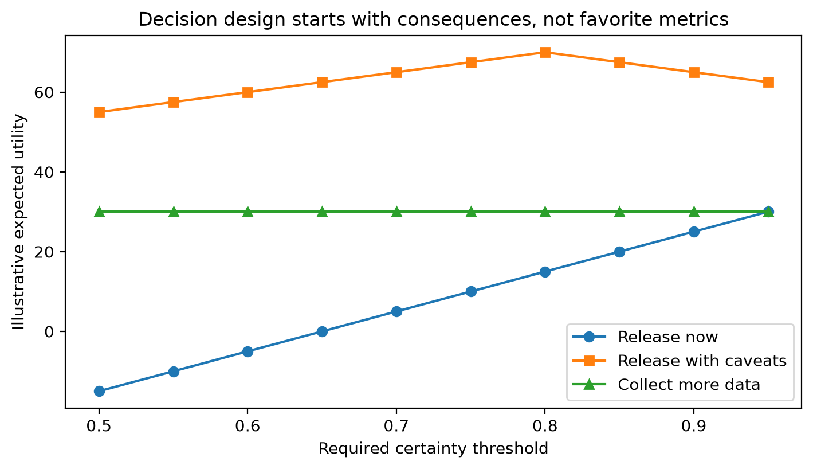

# Chapter 16 · Start with the Decision

Every evaluation starts by naming the decision. In Project Frog, the operational choices are not abstract: release now, release with caveats, collect more data, or block release. Metrics matter only because they help separate those actions.



## Why this chapter comes first

The first reading path starts here because evidence is easier to design when the decision rule is explicit. That frame prevents metric shopping and prepares the later chapters on [measurement](the-metric-is-not-the-system.md), [sampling uncertainty](the-shrinking-pond.md), and [release evidence](release-readiness-under-uncertainty.md).

## Working assumptions

- Project Frog is evaluating a fictional document-handling pipeline.
- The meaningful business harm is unnecessary escalation, missed escalation, and wasted human review.
- End-to-end decisions matter more than any single component score.
- All examples are synthetic.

## Worked Python example

```python
from trustworthy_ai_evaluation.sampling import required_sample_size
from trustworthy_ai_evaluation.validation import metric_comparability_check

release_threshold = 0.90
minimum_meaningful_effect = 0.03
baseline_accuracy = 0.88

planning_n = required_sample_size(
    baseline_rate=baseline_accuracy,
    minimum_effect=minimum_meaningful_effect,
)

comparability = metric_comparability_check(
    same_examples=True,
    same_ground_truth=True,
    same_scoring_code=True,
    same_metric_definition=True,
    same_thresholds=True,
    same_preprocessing=False,
    same_operating_conditions=True,
)

print(planning_n)
print(comparability["classification"])
```

This example forces two preconditions for interpretation: enough data for the decision and a statement about [comparability](../glossary.md#comparability).

## Common incorrect interpretation

> “We can pick the metric after the experiment, once we see what looks best.”

## Corrected interpretation

A defensible evaluation begins with the action rule, the costs of being wrong, and the smallest effect that would change a decision. Only then does it make sense to choose metrics, thresholds, and sample-size targets.

## Decision-oriented conclusions

- Define release actions before defining headline metrics.
- Document what evidence would count as enough.
- Record what would happen if the evidence is mixed or inconclusive.
- Treat comparability requirements as part of the experiment design, not as a footnote.

## Practical exercises

1. Write a one-sentence minimum meaningful effect statement for a release decision.
2. List three conditions that would make two Project Frog evaluations not directly comparable.
3. Decide when “release with caveats” is better than either full release or full delay.

## Summary

<div class="chapter-summary">
A metric is useful only if it changes a real decision. Start by defining actions, harms, thresholds, and required evidence. Then move to [The Metric Is Not the System](the-metric-is-not-the-system.md).
</div>
