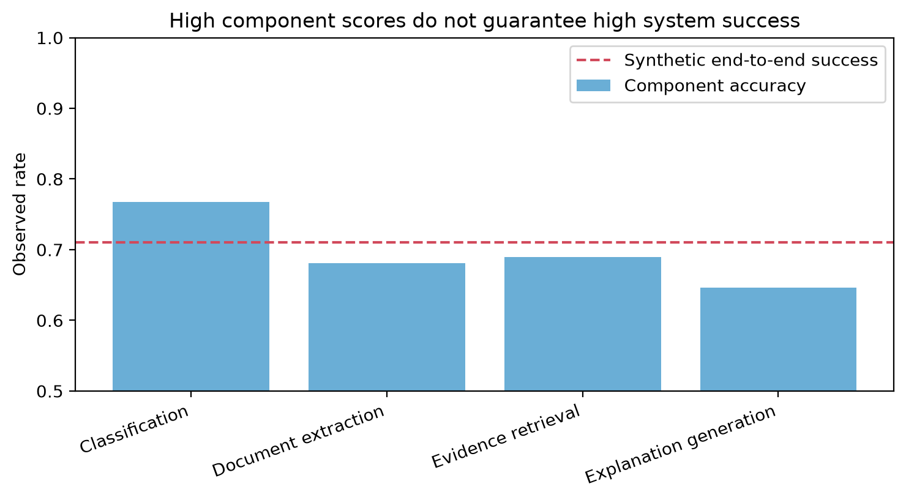

# Chapter 1 · The Metric Is Not the System

A system-level decision should be tied to a system-level outcome. Project Frog has four components, each with its own score, but the operational question is whether the full pipeline supports the desired action.



## Core idea

A good component metric can still fail to answer the system question. [End-to-end outcomes](../glossary.md#end-to-end-outcome) are not the same thing as component correctness, speed, or confidence.

## Working assumptions

- The same case can succeed in one component and fail later in the pipeline.
- Components differ in latency, cost, and failure consequences.
- The target decision is at the system level.
- All scores and outcomes are synthetic.

## Worked Python example

```python
from trustworthy_ai_evaluation.synthetic import generate_project_frog_data, summarize_component_performance

project_frog = generate_project_frog_data(seed=20260914)
component_summary = summarize_component_performance(project_frog)

print(component_summary[["component_name", "accuracy", "mean_latency_ms", "mean_cost_usd"]])
```

The resulting table helps describe component behavior, but it does not prove that the whole system is trustworthy enough for release.

## Common incorrect interpretation

> “If every component looks strong on its own metric, the system must be strong overall.”

## Corrected interpretation

System performance depends on dependencies, cascades, hand-offs, and what the final decision needs. Component metrics are measurements; they are not the system itself.

## Decision-oriented conclusions

- Measure the final event you care about.
- Keep component metrics because they help diagnose failures.
- Do not substitute component success for end-to-end evidence.
- Prepare to examine [sampling uncertainty](the-shrinking-pond.md) before making claims about change.

## Practical exercises

1. Identify one Project Frog component score that would be useful for debugging but weak for release decisions.
2. Describe a pipeline failure that would be invisible if you watched only classification accuracy.
3. List the end-to-end event that your release decision should depend on.

## Summary

<div class="chapter-summary">
Measurements are proxies. Trustworthy evaluation requires showing that the proxy matches the actual decision target. Next, ask how much uncertainty remains in the observed results in [The Shrinking Pond](the-shrinking-pond.md).
</div>
