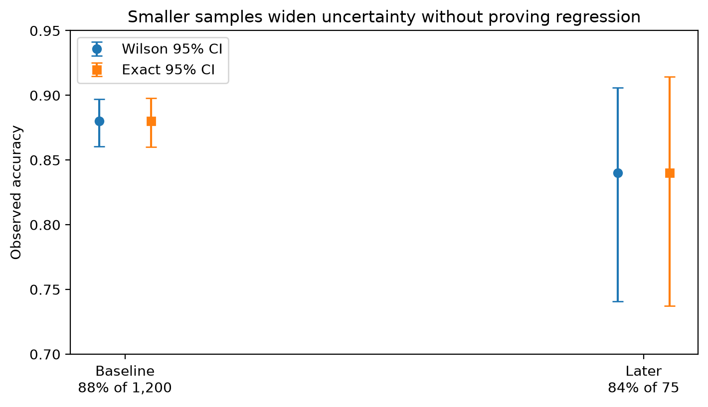

# Chapter 4 · The Shrinking Pond

Project Frog shows **88%** observed accuracy on a baseline sample of **1,200** cases and **84%** observed accuracy later on only **75** cases. The smaller pond looks worse, but the observed drop does not by itself prove that the true system changed.



## What this chapter teaches

This chapter connects [population](../glossary.md#population), sample, expected performance, observed performance, [sampling uncertainty](../glossary.md#sampling-uncertainty), interval estimation, and comparability.

## Working assumptions

- Both reported percentages are sample summaries, not population truths.
- The later sample is much smaller and therefore less precise.
- Comparability still depends on test-set composition, not just row count.
- No regression claim is justified without additional evidence.

## Worked Python example

```python
from trustworthy_ai_evaluation.sampling import (
    bootstrap_interval,
    exact_binomial_interval,
    standard_error_proportion,
    wilson_interval,
)

baseline_accuracy = 1056 / 1200
later_accuracy = 63 / 75
later_standard_error = standard_error_proportion(63, 75)
later_wilson = wilson_interval(63, 75)
later_exact = exact_binomial_interval(63, 75)
later_bootstrap = bootstrap_interval([1] * 63 + [0] * 12, seed=20260914)

print(baseline_accuracy, later_accuracy)
print(later_standard_error)
print(later_wilson)
print(later_exact)
print(later_bootstrap)
```

The three intervals answer slightly different questions but agree on the important point: the later estimate is much less precise than the baseline estimate.

## Population versus sample

The population is the set of future Project Frog cases we care about. The 1,200-case baseline and the 75-case later batch are samples. A smaller sample can produce a lower observed rate even when the true performance is unchanged.

## Expected versus observed performance

Observed accuracy is a sample realization. Expected performance is a population-level average under a defined operating condition. The two are connected, but not identical.

## Standard error

For a sample proportion $\hat{p}$ with sample size $n$, the simple binomial standard error is

$$
SE(\hat{p}) = \sqrt{\frac{\hat{p}(1-\hat{p})}{n}}.
$$

This summary is useful for intuition, but interval choice still matters.

## Wilson, exact, and bootstrap intervals

- **Wilson interval**: strong default for binomial proportions, especially with modest sample sizes.
- **Exact binomial interval**: conservative but assumption-clear when the sample is modeled as Bernoulli draws.
- **Bootstrap interval**: useful when you want a resampling-based summary, but it still reflects only the observed sample and its composition.

## Comparability and composition

Even if the later sample had the same size as the baseline, a change in case mix could change aggregate accuracy. See [Accuracy and Its Discontents](accuracy-and-its-discontents.md) for the composition problem.

## Common incorrect interpretation

> “The later sample is smaller, so that must be why the true accuracy is lower.”

## Corrected interpretation

A smaller sample creates wider uncertainty. It does **not** automatically imply lower true performance, and it does not settle whether the system regressed.

## Decision-oriented conclusions

- Report the observed rate **and** its uncertainty.
- Check whether the test sets are comparable before interpreting change.
- Avoid strong regression claims from a small later sample alone.
- Decide whether more data, a paired comparison, or stratified analysis is needed next.

## Practical exercises

1. Compute Wilson and exact intervals for the baseline and later samples.
2. Write one sentence explaining why 84% on 75 cases is compatible with several different underlying truths.
3. List two composition changes that could alter aggregate accuracy without any model change.

## Summary

<div class="chapter-summary">
Smaller samples widen uncertainty; they do not answer the regression question by themselves. Next, examine whether [accuracy](../glossary.md#accuracy) is even the right summary in [Accuracy and Its Discontents](accuracy-and-its-discontents.md).
</div>
