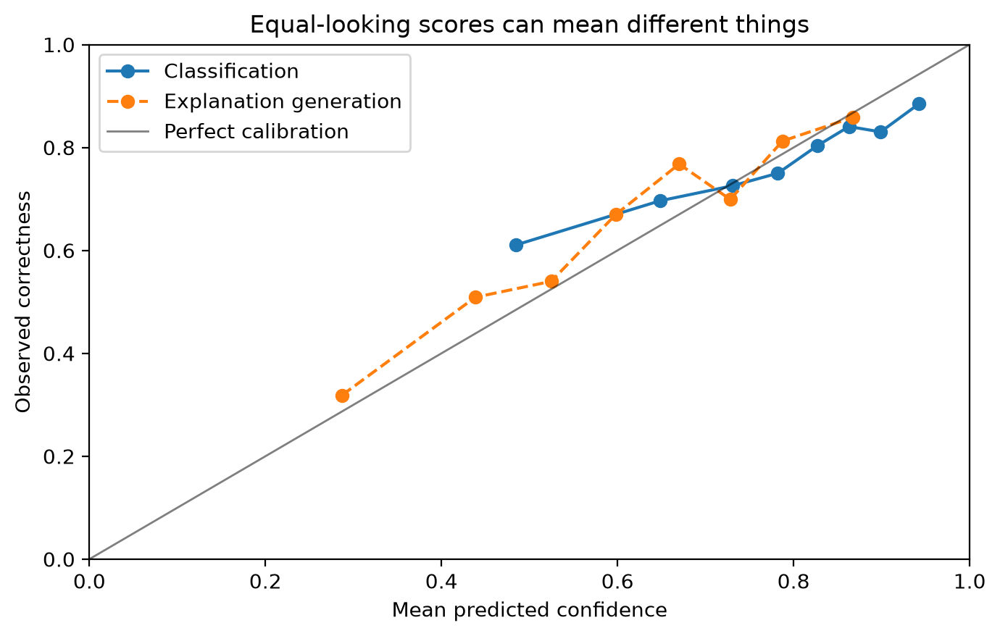

# Chapter 12 · What Does Confidence Mean?

A score of `0.90` is only meaningful after you specify **what event it refers to**, **how it was generated**, and **on what population it was calibrated**. Equal numeric scales do not imply equal meaning.



## Project Frog reminder

Project Frog has four fictional AI components:

- Document extraction
- Classification
- Evidence retrieval
- Explanation generation

Each component emits a score between 0 and 1, but those scores differ in semantics, calibration, and failure modes. See the [confidence semantics card](../reference/confidence-semantics-card.md).

## Working assumptions

- Confidence is meaningful only relative to a clearly defined event.
- Raw scores may be monotone with correctness without being probabilities.
- Calibration is population-dependent and can drift.
- ECE is informative but incomplete.

## Worked Python example

```python
from trustworthy_ai_evaluation.confidence import (
    brier_score_summary,
    calibration_curve_data,
    expected_calibration_error,
)
from trustworthy_ai_evaluation.synthetic import generate_project_frog_data

project_frog = generate_project_frog_data(seed=20260914)
classification = project_frog[project_frog["component_name"] == "Classification"]

curve = calibration_curve_data(
    classification["prediction_correct"].astype(int),
    classification["raw_confidence"],
    n_bins=8,
)
ece = expected_calibration_error(
    classification["prediction_correct"].astype(int),
    classification["raw_confidence"],
    n_bins=8,
)
brier = brier_score_summary(
    classification["prediction_correct"].astype(int),
    classification["raw_confidence"],
)

print(curve[["mean_prediction", "observed_rate", "count"]])
print(ece)
print(brier)
```

## Raw scores versus calibrated probabilities

`raw_confidence` is a model-native score. `calibrated_probability` is a post-processing estimate intended to approximate a probability of correctness on a stated calibration population. Those are different objects and should be reported as such.

## Reliability diagrams, Brier score, and ECE

- **Reliability diagram / calibration curve**: visual comparison between stated confidence and observed outcomes.
- **Brier score**: squared-error summary for binary probabilistic predictions.
- **Expected calibration error**: a compact diagnostic, but sensitive to binning and blind to some subgroup failures.

## Common incorrect interpretation

> “Two components both output 0.90, so they are equally confident in the same sense.”

## Corrected interpretation

Numeric equality does not imply semantic equality. A 0.90 extraction score, 0.90 retrieval relevance score, and 0.90 calibrated class probability can refer to different events and different populations.

## Decision-oriented conclusions

- Record score semantics before using a score operationally.
- Compare like with like: same target event, same population, same calibration claim.
- Audit subgroup calibration and drift before trusting a probability-like score.
- Do not rely on ECE alone.

## Practical exercises

1. Describe one reason ECE can look acceptable while subgroup calibration is poor.
2. Write the intended meaning of `raw_confidence` and `calibrated_probability` in separate sentences.
3. Name a decision that requires calibrated probabilities rather than raw ranking scores.

## Summary

<div class="chapter-summary">
Confidence needs semantics, calibration context, and a target event. Once those are explicit, you can ask whether different scores should ever be combined in [Combining Confidence Scores](combining-confidence-scores.md).
</div>
