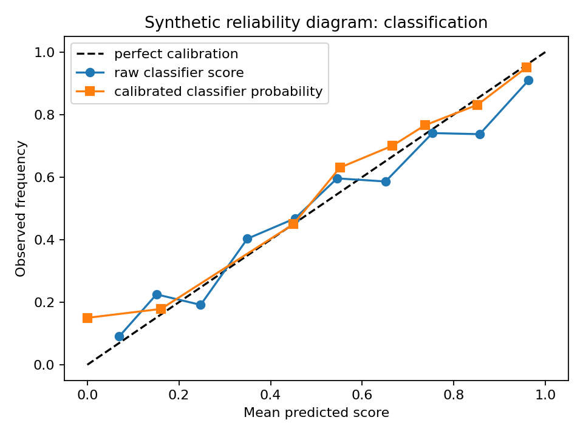

# 13. Calibration

**Synthetic note:** all figures and results below come from the fictional Project Frog experiment.

Calibration asks whether a score that claims to be probabilistic behaves like a probability on a defined population.

## Confidence versus correctness

A model can be highly confident and still often wrong. It can also be underconfident and still rank cases well. Calibration is therefore distinct from accuracy and ranking quality.

## Raw scores versus estimated probabilities

Project Frog's classification score claims to be a probability. The other three scores do not. For teaching purposes, the synthetic experiment still maps every raw score to an estimated probability of its own component-level event using isotonic regression.

That mapping does **not** make the four probabilities semantically interchangeable. It only makes each one easier to evaluate against its own target event.

## Worked Python example

```python
from trustworthy_ai_evaluation import (
    brier_score_summary,
    calibration_curve_data,
    expected_calibration_error,
)

bins = calibration_curve_data([0, 1, 1, 0], [0.1, 0.8, 0.7, 0.2], n_bins=2)
ece = expected_calibration_error([0, 1, 1, 0], [0.1, 0.8, 0.7, 0.2], n_bins=2)
summary = brier_score_summary([0, 1, 1, 0], [0.1, 0.8, 0.7, 0.2], n_bins=2)
```

## Reliability diagram



In the synthetic evaluation split, the raw classification score is overconfident on harder bins. The calibrated mapping moves the curve closer to the diagonal, but not perfectly under deployment shift.

## What to inspect

- Reliability diagrams and calibration curves
- [Brier score](../reference/glossary.md#brier-score)
- [Expected calibration error](../reference/glossary.md#expected-calibration-error)
- Overconfidence and underconfidence
- Dataset-dependent calibration
- Calibration drift between development and evaluation populations
- [Subgroup calibration](../reference/glossary.md#subgroup-calibration)

## Why expected calibration error is not enough

ECE is useful, but incomplete.

- It depends on the chosen bins.
- It can hide offsetting errors.
- It does not measure discrimination.
- It can look acceptable in aggregate while masking subgroup failures.
- It does not tell you whether the score targets the right decision event.

For that reason, this book does not treat ECE as a complete calibration assessment.

## Subgroup view

The synthetic experiment reports separate results for `Simple`, `Moderate`, and `Complex` cases. Aggregate calibration improves after isotonic mapping, but complex-case calibration remains worse because the calibration population under-represents them.

## Common incorrect interpretation

> “ECE went down, so the score is now trustworthy.”

## Corrected interpretation

Lower ECE is evidence of improved aggregate calibration under one evaluation design. It is not proof that the score is sufficient for all decisions, subgroups, or future populations.

## Decision-oriented conclusion

Use calibration to decide whether a score can support probability-based thresholds for a specific event and population. Re-check after drift, subgroup shifts, or changes to upstream components.

## Exercises

1. Why can a well-ranked model still be badly calibrated?
2. What does isotonic calibration change, and what does it leave unchanged?
3. Why should subgroup calibration be examined even when aggregate ECE is low?

## Summary

Calibration is empirical. It belongs to an event, a population, and a time period, not to a number in isolation.
