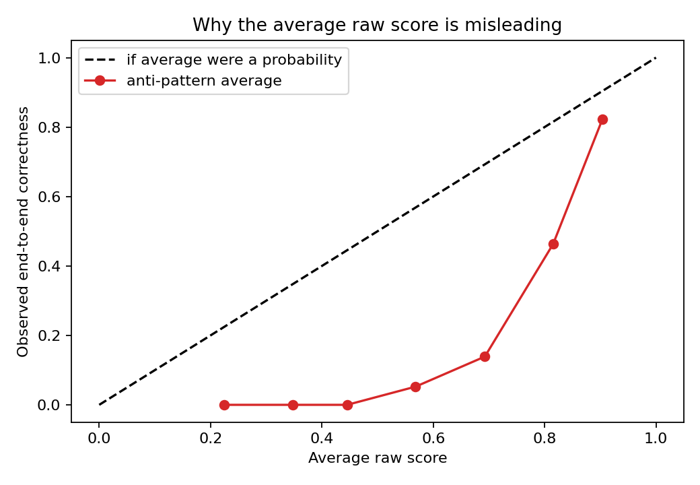
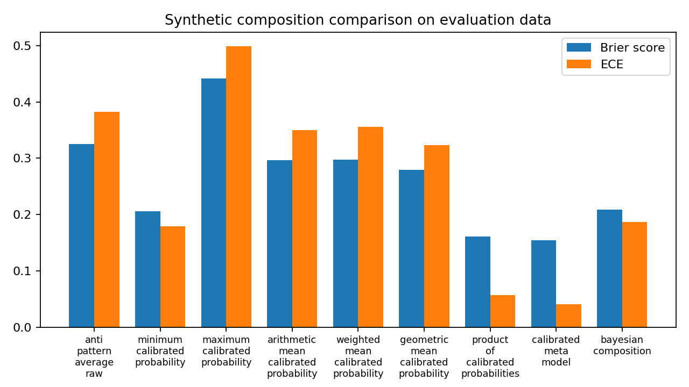

# 14. Combining Confidence Scores

**Synthetic note:** Project Frog results in this chapter come from the generated experiment in `project_frog_experiment.py`.

There is no universal formula for combining confidence-like scores across a pipeline.

## Anti-pattern

> **Overall confidence equals the average of all available component scores.**

This is not meaningful unless the component scores share compatible semantics and the resulting quantity is empirically validated against an end-to-end outcome.

The synthetic experiment shows exactly why.



High average raw scores can still correspond to low observed end-to-end correctness.

## Worked Python example

```python
from trustworthy_ai_evaluation.project_frog_experiment import run_experiment

results = run_experiment(random_state=7)
for row in results["scalar_method_results"][:3]:
    print(row["method"], row["brier_score"], row["expected_calibration_error"])
```

## Composition approaches

### Minimum
- **Meaning:** weakest component score or probability
- **Required assumptions:** the weakest component dominates risk
- **Semantic compatibility:** still required if interpreted probabilistically
- **Calibration requirement:** needed if thresholds are probability-based
- **Dependence concern:** correlated weak components can make it overly conservative
- **Validation design:** test against decisions that should be blocked by any weak link
- **Failure mode:** one noisy component vetoes safe cases
- **Suitable:** conservative gating
- **Unsuitable:** end-to-end probability estimation

### Maximum
- **Meaning:** strongest component score
- **Required assumptions:** one strong signal can justify action
- **Semantic compatibility:** required for probability-like interpretation
- **Calibration requirement:** required if used as probability
- **Dependence concern:** hides upstream failures
- **Validation design:** inspect false reassurance cases
- **Failure mode:** optimistic masking
- **Suitable:** review prioritization
- **Unsuitable:** trust estimation

### Arithmetic mean
- **Meaning:** average of component values
- **Required assumptions:** compatible semantics and stable weighting by equal importance
- **Semantic compatibility:** essential
- **Calibration requirement:** essential if the result is read as a probability
- **Dependence concern:** dependence breaks any simple probabilistic story
- **Validation design:** compare against end-to-end labels and failure strata
- **Failure mode:** semantically empty but numerically plausible output
- **Suitable:** only after strong empirical validation for a narrow use case
- **Unsuitable:** generic “overall confidence”

### Weighted arithmetic mean
- **Meaning:** policy-weighted average
- **Required assumptions:** weights encode stable decision trade-offs
- **Semantic compatibility:** still required
- **Calibration requirement:** still required
- **Dependence concern:** hidden correlations can dominate weight choices
- **Validation design:** sensitivity analysis over weights and populations
- **Failure mode:** arbitrary weight selection changes the meaning
- **Suitable:** governed scorecards
- **Unsuitable:** transportable probability statements

### Geometric mean
- **Meaning:** multiplicative-style average that penalizes low inputs
- **Required assumptions:** common scale and some multiplicative rationale
- **Semantic compatibility:** required
- **Calibration requirement:** required
- **Dependence concern:** correlated failures distort interpretation
- **Validation design:** compare against weak-link failures
- **Failure mode:** unstable collapse near zero
- **Suitable:** soft conservative ranking
- **Unsuitable:** opaque probability claims

### Product
- **Meaning:** naive joint-success estimate
- **Required assumptions:** aligned events and defensible independence or chain-rule decomposition
- **Semantic compatibility:** required
- **Calibration requirement:** required
- **Dependence concern:** usually severe
- **Validation design:** inspect calibration under correlated failure
- **Failure mode:** false precision from invalid independence assumptions
- **Suitable:** rare narrow chains with justified assumptions
- **Unsuitable:** most multi-component AI pipelines

### Rule-based policy
- **Meaning:** decision rule, not probability
- **Required assumptions:** thresholds reflect reviewed policy
- **Semantic compatibility:** weaker because the output is a policy action
- **Calibration requirement:** useful but not always necessary for every threshold
- **Dependence concern:** threshold interactions can create blind spots
- **Validation design:** decision utility, failure review, subgroup checks
- **Failure mode:** brittle threshold edges
- **Suitable:** triage and review workflows
- **Unsuitable:** probability reporting

### Calibrated meta-model
- **Meaning:** learned end-to-end probability estimate from the whole score vector
- **Required assumptions:** labeled end-to-end training data and monitoring
- **Semantic compatibility:** achieved by learning against the end-to-end target
- **Calibration requirement:** essential
- **Dependence concern:** training data must represent the dependency structure
- **Validation design:** held-out end-to-end calibration, discrimination, utility, subgroup tests
- **Failure mode:** drift when upstream score semantics change
- **Suitable:** selective automation with labels
- **Unsuitable:** zero-label settings

### Bayesian composition where assumptions are defensible
- **Meaning:** probabilistic system estimate under an explicit generative model
- **Required assumptions:** state them; defend them; test them
- **Semantic compatibility:** required
- **Calibration requirement:** required
- **Dependence concern:** conditional independence claims are often fragile
- **Validation design:** posterior calibration, subgroup error analysis, assumption stress tests
- **Failure mode:** elegant math built on false assumptions
- **Suitable:** narrow domains with auditable structure
- **Unsuitable:** vague “Bayesian” aggregation rhetoric

### Retaining a vector of separate scores
- **Meaning:** structured evidence rather than one scalar
- **Required assumptions:** humans or policies can use the vector appropriately
- **Semantic compatibility:** not required across components because the scores stay separate
- **Calibration requirement:** component-specific
- **Dependence concern:** must still be considered during review
- **Validation design:** reviewer agreement and decision quality
- **Failure mode:** cognitive overload
- **Suitable:** auditing and high-stakes review
- **Unsuitable:** scalar-only dashboards

### Converting evidence into a system risk category
- **Meaning:** low/medium/high operational risk label
- **Required assumptions:** categories are decision artifacts with reviewed boundaries
- **Semantic compatibility:** only enough to support the categorization rule
- **Calibration requirement:** desirable but category quality matters more than numeric precision
- **Dependence concern:** categories can hide clustered failures
- **Validation design:** confusion by category, utility, subgroup coverage
- **Failure mode:** false simplicity
- **Suitable:** operational triage
- **Unsuitable:** exact probability communication

### Abstention and human review
- **Meaning:** selective prediction policy
- **Required assumptions:** review capacity exists and adds value
- **Semantic compatibility:** only enough to support the abstention rule
- **Calibration requirement:** important for threshold design
- **Dependence concern:** hard subgroups may receive most abstentions
- **Validation design:** coverage-risk trade-off, subgroup coverage, review outcomes
- **Failure mode:** too little coverage or too much residual risk
- **Suitable:** high-stakes deployment
- **Unsuitable:** settings that demand fully automated action

## Composition experiment snapshot



The calibrated meta-model performs better than the anti-pattern average because it is trained against the actual end-to-end target. Even then, it still requires drift monitoring and subgroup validation.

## Decision-oriented conclusion

Do not ask for a universal combination formula. Ask what decision the aggregate is supposed to support, what assumptions it needs, and how it was validated.

## Exercises

1. Which composition approaches yield a probability-like output, and under what assumptions?
2. Why can a rule-based policy be valid even when it is not a probability model?
3. Why is keeping a vector sometimes better than forcing a scalar?

## Summary

A pipeline score is meaningful only when its semantics, assumptions, and validation design are explicit.
