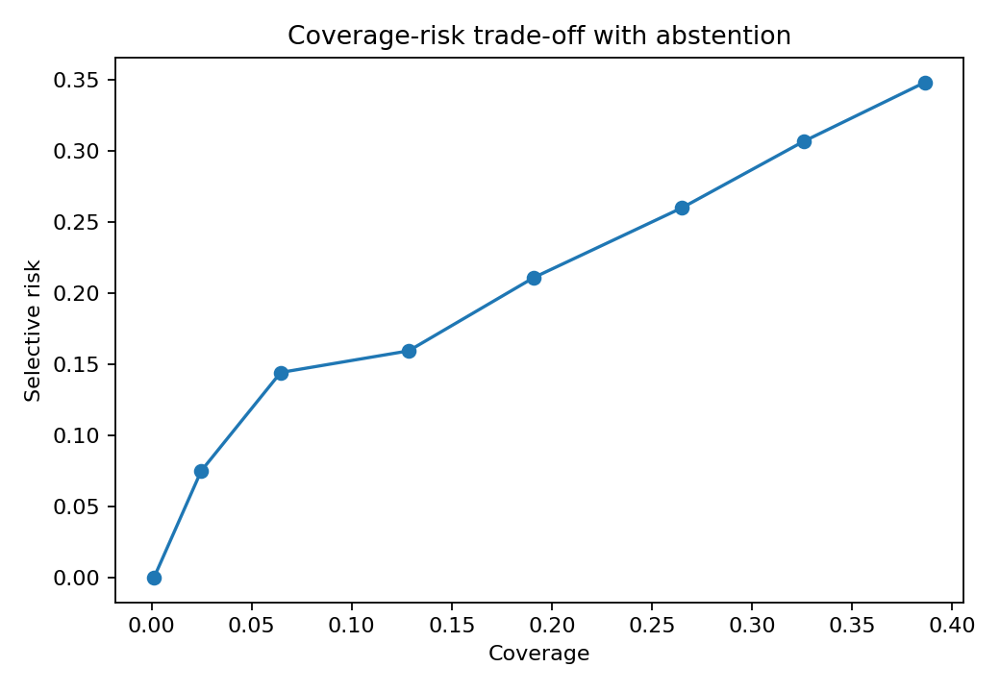

# 15. System-Level Trust Is Not the Average of Component Confidence

**Core conclusion:** **System-level trust must be validated against an end-to-end outcome. It cannot be inferred merely by combining component scores.**

## Why averages fail

Project Frog is a pipeline. Failures can be:

- **conditionally dependent**
- **correlated across components**
- **cascading from upstream errors**
- **subgroup-specific**

A polished explanation does not repair a bad retrieval step. A confident classifier does not rescue a corrupted extraction. End-to-end correctness is its own target.

## Synthetic experiment design

The synthetic Project Frog experiment does five things:

1. Generates correlated component outcomes.
2. Creates raw scores with different semantics and calibration behavior.
3. Calibrates component-level probabilities on a development split.
4. Compares scalar aggregation methods, policy methods, and abstention.
5. Evaluates calibration, discrimination, decision utility, subgroup behavior, failure cases, and coverage-risk trade-offs.

Generated assets:

- [`project_frog_confidence_dataset.csv`](../assets/generated/project_frog_confidence_dataset.csv)
- [`project_frog_method_results.json`](../assets/generated/project_frog_method_results.json)
- 

## Failure decomposition

In the synthetic data, upstream extraction failures raise downstream classification and retrieval error rates. That dependence makes naive products and averages misleading even when the component scores look individually plausible.

## Selective prediction and abstention

If the end-to-end model is uncertain, abstention is often better than a forced automated answer.

Key operational questions:

- What fraction of cases can the system handle automatically?
- What error rate remains among automated cases?
- Which subgroups receive most abstentions?
- Does human review actually reduce risk?

## Worked Python example

```python
from trustworthy_ai_evaluation.project_frog_experiment import run_experiment

results = run_experiment(random_state=7)
for row in results["policy_results"]:
    print(row["method"], row["coverage"], row["selective_risk"], row["decision_utility"])
```

## Common incorrect interpretation

> “Every component is above 0.90, so the system must be trustworthy.”

## Corrected interpretation

Those component values can refer to different events, different populations, and different failure modes. Trust must be evaluated on the **end-to-end decision outcome**.

## Assumptions

- End-to-end labels exist for validation.
- Review and escalation are feasible operational actions.
- Subgroup behavior matters, not just aggregate performance.
- Dependency structure can change over time and must be monitored.

## Decision-oriented conclusion

For system-level trust, validate the full decision path. If end-to-end evidence is weak, keep scores separate, abstain more often, or route cases to review.

## Exercises

1. Give one example of a cascading error in Project Frog.
2. Why can a calibrated component still participate in an untrustworthy system?
3. What additional evidence is needed before a selective prediction policy is operationally safe?

## Summary

Trust belongs to the decision outcome, not to the arithmetic average of component scores.
